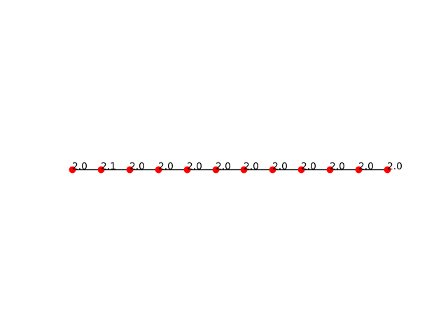

На данный момент стоят задачи по
1) Изучение разных значений мощностей холостого хода для каждого двигателя
2) Решить проблему с отрицатиельными значениями
3) Изменить подход от генерации n (n=12) значений к временному интервалу
   

