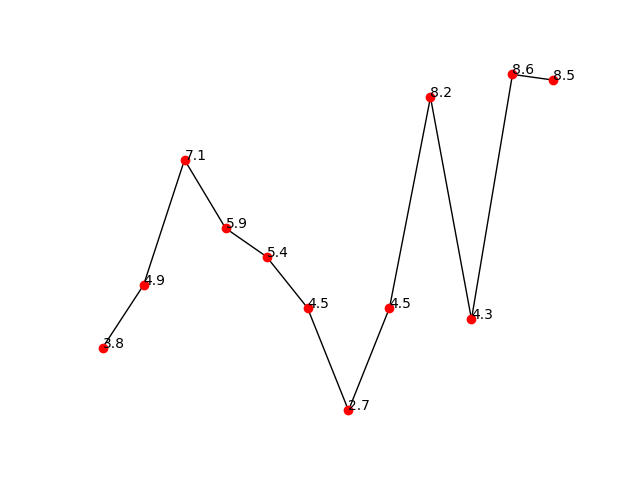

# Выявление обрыва ремней станков-качалок

Система ищет обрыв клиновых ремней СК по телеметрии активной мощности
привода. Идея простая: рвётся ремень — двигатель перестаёт «чувствовать»
колонну штанг и уходит на холостой ход, характерная пила нагрузки на
графике мощности выпрямляется в полку.

Мощность превращается во временные окна, окна рисуются графиками, графики
классифицирует YOLOv8-cls на два класса: `good` (станок работает) и `bad`
(подозрение на обрыв).

| `bad` — полка холостого хода | `good` — рабочая нагрузка |
|---|---|
|  |  |

## Конвейер

```
Excel-выгрузка  ->  очистка сигнала  ->  холостой ход по скважине
                        |                        |
                        v                        v
                нарезка по времени  ->  нормировка  ->  PNG  ->  YOLOv8-cls  ->  good / bad
```

## Установка

```bash
pip install -r requirements.txt
```

## Как пользоваться

Всё запускается через `main.py`.

```bash
python main.py idle --csv idle.csv
```
Таблица холостого хода по каждому двигателю.

```bash
python main.py dataset --window 60min --resample 5min --points 12 --out plots
```
Строит графики из выгрузки и раскладывает по папкам `Скв_<номер>`.

```bash
python main.py train --epochs 60
```
Обучает классификатор на `classificator/dataset`.

```bash
python main.py eval --split valid
```
Метрики модели: accuracy, матрица ошибок, precision/recall/F1 по классам.

```bash
python main.py predict plots/Скв_1101 --min-confidence 0.6
```
Инференс по картинке или папке.

```bash
python main.py gui
```
Окно оператора: выбрать папку, получить список подозрений на обрыв.

Тесты алгоритмов:

```bash
python tests/test_algorithms.py
```

## Что сделано по задачам из старого README

### 1. Разные мощности холостого хода у разных двигателей

Холостой ход теперь оценивается отдельно для каждой скважины
(`algorithms.estimate_idle_power`). Гистограмма мощности бимодальна:
нижняя мода — холостой ход, верхняя — работа под нагрузкой. Порог Оцу
делит их без предположений о форме распределения, медиана нижнего
кластера даёт устойчивый уровень.

По текущей выгрузке (192 скважины, 195 715 замеров) холостой ход
разошёлся от 0 до 18.3 кВт при медиане 1.7 кВт — то есть общего порога
«ниже X кВт значит обрыв» не существует в принципе. Для 184 скважин из
192 разделение по Оцу состоялось, для остальных берётся запасной вариант
по нижнему квантилю, и это видно в колонке `метод` отчёта.

График нормируется относительно холостого хода своей скважины: 0 —
холостой ход, 1 — типовая рабочая нагрузка. Поэтому одинаковый режим у
двигателя на 2 кВт и у двигателя на 18 кВт даёт одинаковую картинку.

### 2. Отрицательные значения

В выгрузке 13 202 отрицательных замера (6.7%), вплоть до −32 кВт при
максимуме +49 кВт. Причины разные, поэтому обработка разделена на два шага
(`algorithms.clean_values`):

* **Одиночные выбросы счётчика** снимает фильтр Хампеля по скользящим
  медиане и MAD. Медиана не «уезжает» от выброса, в отличие от среднего,
  поэтому провал в −32 кВт не поднимает порог и не маскирует соседей.
  Отдельно закрыт известный вырожденный случай: на ровной полке MAD равен
  нулю и порог схлопывается — масштаб ограничен снизу разрешением счётчика
  и долей общего разброса ряда. Проверено тестом, что при этом вершины
  нормальных колебаний фильтр не срезает.
* **Систематический знак** — стратегией `--negatives`: `clip` (по
  умолчанию, обрезка по нулю), `keep` (оставить: на ходе вниз колонна
  штанг может раскручивать двигатель, и отрицательная мощность физична),
  `abs` (перепутан знак у счётчика), `drop` (выкинуть, окно отбракуется по
  покрытию).

### 3. Нарезка по времени вместо n = 12 отсчётов

Было: `v[i * 12 : (i + 1) * 12]`. Период опроса счётчиков по факту гуляет
от 15 с до 45 мин (медиана по скважинам — 239 с), поэтому «окно из 12
точек» покрывало от 3 минут до 9 часов, и графики разных скважин были
принципиально несравнимы. Заодно окно молча склеивало данные через
разрывы телеметрии.

Стало (`algorithms.iter_time_windows`): ряд ресемплится на равномерную
сетку, режется окнами заданной длительности с заданным шагом, каждое окно
интерполируется в фиксированное число точек. Окна, где доля реальных (не
интерполированных) отсчётов ниже `min_coverage`, отбрасываются — дыры в
телеметрии больше не превращаются в «ровную полку», похожую на обрыв.

## Что нашлось при разборе кода

* **Утечка признака в датасете.** Картинки лежат в трёх разных размерах, и
  размер коррелирует с классом: из 287 `good` — 190 штук 660×499, а `bad`
  почти весь 640×480. Сеть могла выучить размер холста вместо формы
  сигнала. Рендер теперь всегда выдаёт один и тот же размер; старый
  датасет стоит перегенерировать.
* **Нормировка теряла амплитуду.** Старый min-max внутри окна растягивал
  плоскую полку холостого хода на всю высоту картинки — то есть ровно
  признак обрыва превращался в картинку нормальной работы. Костыль
  `if pstdev < 0.65: значения = 0.3` это лечил лишь частично, а на
  константном окне деление на `max - min` падало с ZeroDivisionError.
  Сейчас масштаб общий для скважины, полка остаётся полкой.
* **Модель `files/best.pt` пропускает обрывы.** На `valid` accuracy 0.825
  выглядит прилично, но она держится на перекошенных классах: recall по
  `bad` — 0.357 (5 находок из 14), на `test` — 0.222. Две трети обрывов
  модель не видит. Поэтому `eval` печатает матрицу ошибок и recall, а не
  одну accuracy.
* **`test_model.py` невозможно было прогнать без оператора.** Жёстко
  зашитый путь `C:\Users\User\...`, предикт по одной картинке в цикле,
  `cv2.imshow` + `waitKey(0)` на каждом кадре, импорт `customtkinter`,
  который в файле не использовался. Переписан на параметры командной
  строки, батчевый предикт и метрики.
* **`conf.index(max(conf))`** вместо `probs.top1` — молча ломается при
  повторе максимума в списке вероятностей.
* **`train.py` был пустым**, параметры обучения нигде не зафиксированы.
  Теперь они в `config.TrainConfig`, аугментации подобраны под графики:
  переворот по вертикали выключен (он превращает холостой ход в нагрузку),
  `erasing` выключен (дефолтные 0.4 стирают часть линии), сдвиги цвета
  выключены. Есть ранняя остановка и фиксированный seed.
* **Утечки памяти в отрисовке.** Ноутбук создавал график поверх
  глобального состояния pyplot на каждой итерации. Фигура теперь одна на
  весь прогон, backend `Agg`.
* **Битые ссылки в README** (`bad.png` / `good.png` переехали в `files/`) и
  `.gitignore.txt`, который git не читает как `.gitignore`.

## Структура

| Файл | Назначение |
|---|---|
| `main.py` | CLI: `idle`, `dataset`, `train`, `eval`, `predict`, `gui` |
| `config.py` | пути и параметры алгоритмов в одном месте |
| `algorithms.py` | очистка сигнала, холостой ход, нарезка по времени, нормировка |
| `Class_dataset.py` | Excel → временные окна → PNG, отчёт по холостому ходу |
| `Class_Predict.py` | инференс YOLOv8-cls и метрики |
| `Class_start.py` | окно оператора на customtkinter |
| `classificator/train.py` | обучение классификатора |
| `classificator/test_model.py` | метрики на размеченном сплите |
| `tests/test_algorithms.py` | тесты алгоритмов |
| `plotes.ipynb` | исходный черновик конвейера (оставлен как история) |

## Что дальше

1. Перегенерировать датасет новым рендером и переобучить — текущий recall
   по `bad` для эксплуатации низковат.
2. Добить баланс классов: `bad` в датасете в пять раз меньше, чем `good`.
   Нужны либо веса классов, либо целевой сбор картинок с обрывами.
3. Проверить, нужен ли вообще классификатор картинок: холостой ход теперь
   считается численно, и порог «мощность держится у холостого хода дольше
   T минут» стоит замерить как baseline перед сетью.
